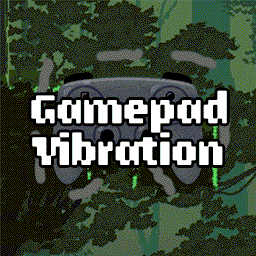

# JumpKing Gamepad Vibration Mod

This mod adds gamepad vibration to JumpKing. It is a simple mod that uses the XInput API to control the vibration motors in the gamepad.

https://steamcommunity.com/sharedfiles/filedetails/?id=3234564141
